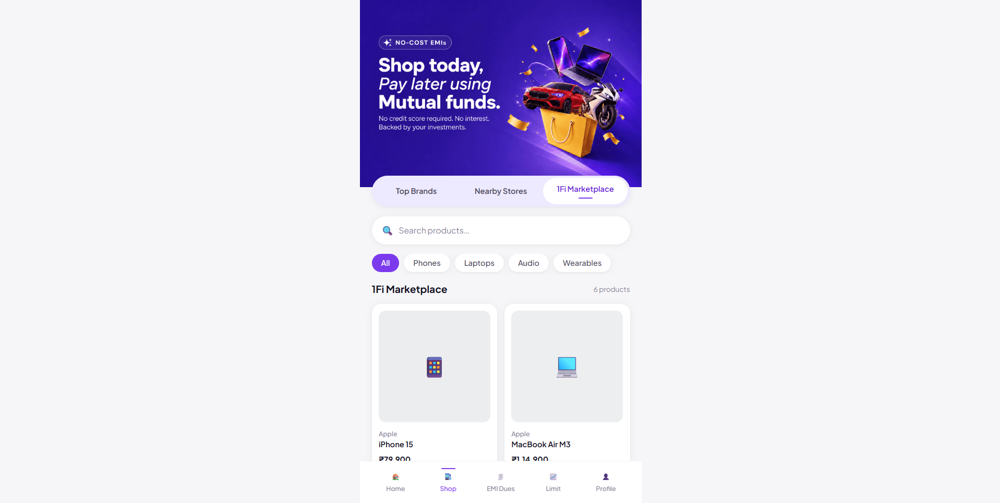
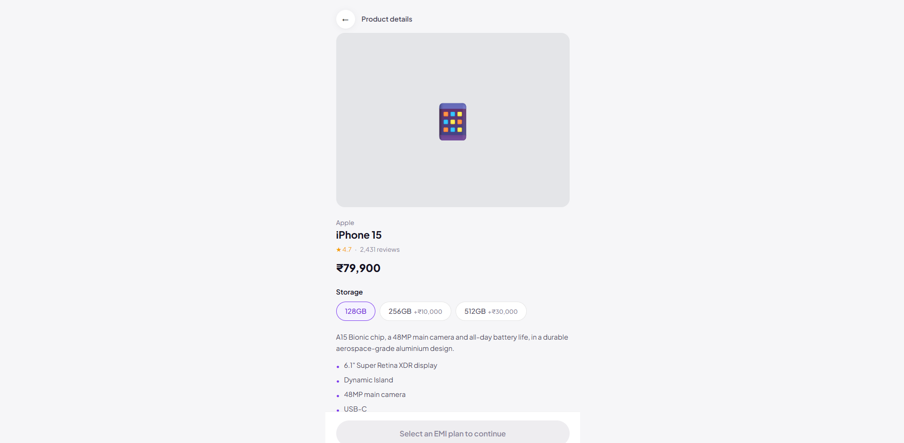
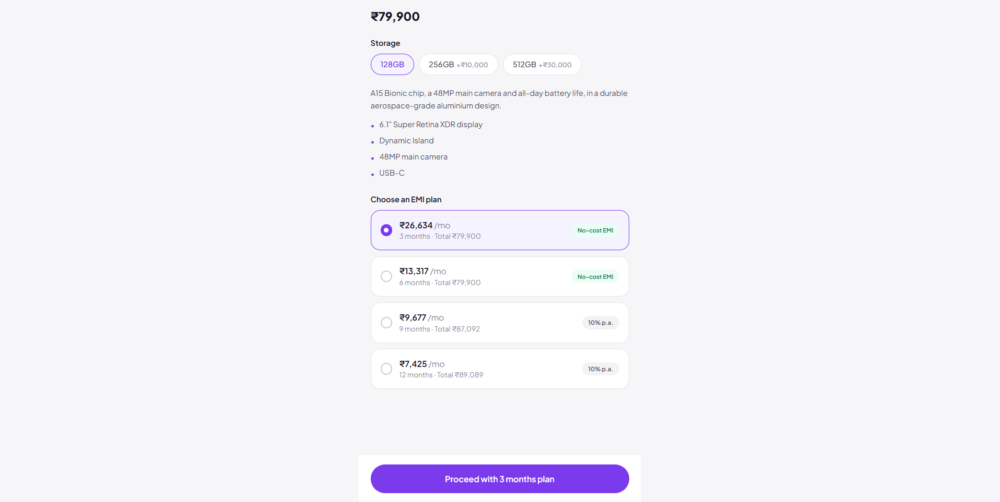

# 1Fi Marketplace — SDE Intern Assignment

This project adds a **1Fi Marketplace** section to the existing Shop page.

The marketplace includes product search, category filters, product details, EMI plans, and an EMI confirmation flow.

## Screenshot

### Marketplace


### Product Details


### EMI Confirmation


> Put your screenshots inside a `screenshots` folder in the project and use the same file names as above.

## How to Run

First, install the dependencies:

```bash
npm install
```

Then start the project:

```bash
npm run dev
```

Open the local URL shown in the terminal, usually:

```text
http://localhost:5173
```


## What I Built

### 1. Shop Page
- Added the `1Fi Marketplace` tab.
- Kept `Top Brands` and `Nearby Stores` as blank tabs because they were not required for this assignment.

### 2. Marketplace
- Search products
- Filter products by category
- Responsive product grid
- Loading state
- Error state with retry
- Empty state

### 3. Product Details
- Product image
- Rating
- Price
- Product variants such as storage, colour, or size
- Product description
- Product highlights
- EMI plans

When the product variant changes, the EMI plans are updated based on the new price.

### 4. EMI Selection
- Select an EMI plan
- Click the main CTA button
- See a confirmation screen with:
  - Monthly EMI
  - Tenure
  - Total amount payable

## Project Structure

The main code is inside the `src` folder.

```text
src/
├── api/
│   ├── marketplaceApi.js
│   └── products.data.js
│
├── components/
│   ├── common/
│   └── marketplace/
│
├── hooks/
│   ├── useProducts.js
│   ├── useProductDetail.js
│   └── useEmiPlans.js
│
├── pages/
│   ├── ShopPage.jsx
│   ├── MarketplaceTab.jsx
│   ├── ProductDetailPage.jsx
│   ├── TopBrandsTab.jsx
│   └── NearbyStoresTab.jsx
│
└── utils/
    └── emi.js
```

### What these folders do

- **api** — Contains the product data and functions used to get marketplace data.
- **components** — Contains reusable UI components.
- **hooks** — Contains React hooks used to load products and EMI plans.
- **pages** — Contains the main pages of the marketplace.
- **utils** — Contains the EMI calculation logic.

## Tech Used

- React
- JavaScript
- React Router
- Tailwind CSS

## Notes

The project currently uses mock product data instead of a real backend.

The API file simulates network delay and errors. This makes it easier to test loading and error states.

The app also works in a phone-like layout on desktop and becomes full-screen on smaller screens.

